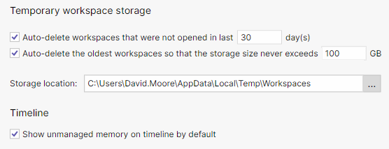

# Setting up Windows for development

## Dev Drive

```powershell

# Trust the drive
fsutil devdrv trust D:

# Verify
fsutil devdrv query <drive-letter>:

```


Using D: as the example dev drive

Create a Packages folder

```powershell
mkdir D:\packages\NuGet\cache,D:\packages\npm
[Environment]::SetEnvironmentVariable('NPM_CONFIG_CACHE', 'D:\packages\npm')
[Environment]::SetEnvironmentVariable('NUGET_PACKAGES', 'D:\packages\NuGet\cache')
```

npm

Create an npm folder, and point npm_config_cache environment variable to it.
Defaults to %LocalAppData%\npm-cache

npm cache clean if you like

npm get config cache

npm set config cache D:\packages\npm

NuGet

Create a NuGet folder, and point NUGET_PACKAGES  environment variable to it.

dotnet nuget config paths

C:\Users\DavidMoore\AppData\Roaming\NuGet\NuGet.Config
C:\Program Files (x86)\NuGet\Config\Microsoft.VisualStudio.FallbackLocation.config
C:\Program Files (x86)\NuGet\Config\Microsoft.VisualStudio.Offline.config


dotnet nuget locals global-packages --list:

global-packages: D:\packages\NuGet\cache


JetBrains

dotMemory temp workspace location




## References

[Set up a Dev Drive on Windows 11](https://learn.microsoft.com/en-us/windows/dev-drive/)